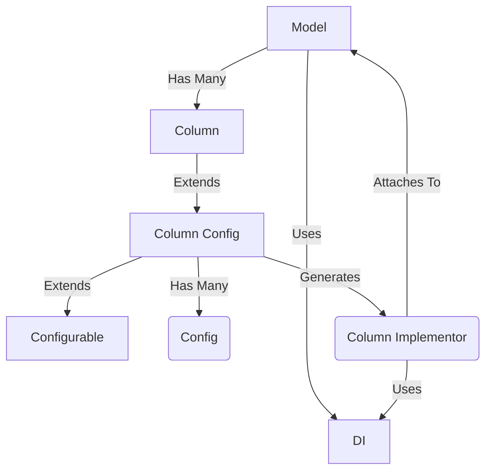

Models are configured by attaching columns as properties:

```python
import clearskies.
def SomeModel:
    name = columns.String(required=True)
    age = columns.Integer()
```

This generates a Column object (`clearskies.columns.*`), which themselves have many configuration settings and extend `clearskies.column_config.ColumnConfig`.  These are just a way of storing configuration information, but have no real functions themselves (other than validating their configuration).  When the model needs to actually do something with data, it runs through a process to convert the ColumnConfig objects into the various Config Implementors (`clearskies.columns.implementors.*`).  These objects are created via the dependency injection system and configured according to the ColumnConfig object, thus bringing all the pieces together so the model and columns can work together to get things done.

Note that we separate column configs and column implementors for the same reason that the BindingConfig class works.  Configurable classes tend to clash with dependency injection because, when configuring something, you want to create it and set its values, but when working with dependency injection the developer can't create an instance - the DI system must.  Splitting up functionality into configuration and impelementation is one way to "solve" those competing needs.  The developer creates the configuration instance and then that is used by the framework when making the objects that actually do the work.


