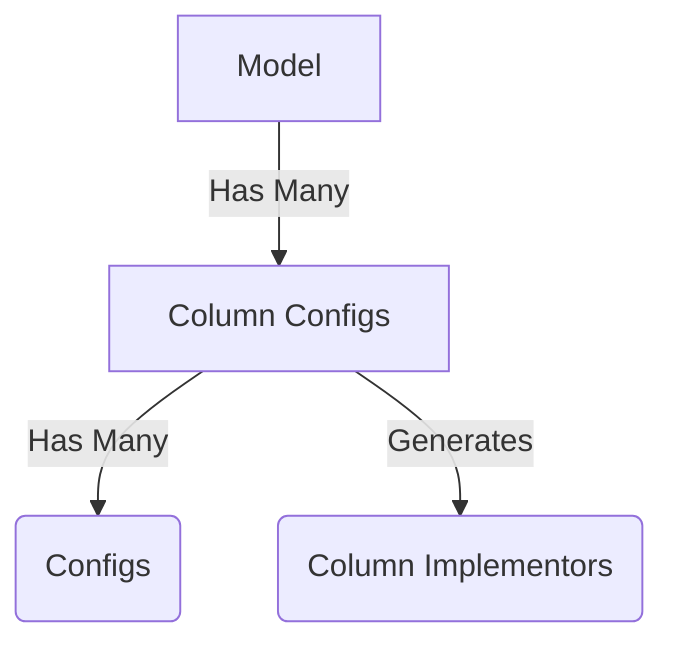

```mermaid
graph TD;
    model[Model] -->|Has Many| column_configs[Column Configs];
    column_configs --> |Has Many| configs(Configs);
    column_configs --> |Generates| column_implementors(Column Implementors);
```
