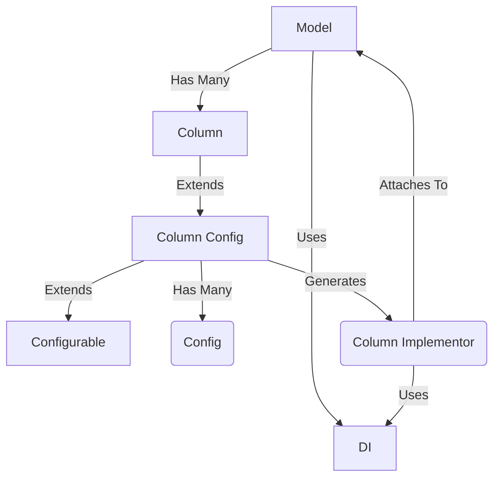

Models are configured by attaching columns as properties:

```
import clearskies.
def SomeModel:
    name = columns.String(required=True)
    age = columns.Integer()
```

This generates a Column object (`clearskies.columns.*`), which themselves have many configuration settings and extend `clearskies.column_config.ColumnConfig`.  These are just a way of storing configuration information, but have no real functions themselves (other than validating their configuration).  When the model needs to actually do something with data, it runs through a process to convert the ColumnConfig objects into the various Config Implementors (`clearskies.columns.implementors.*`).  These objects are created via the dependency injection system and configured according to the ColumnConfig object, thus bringing all the pieces together so the model and columns can work together to get things done.


